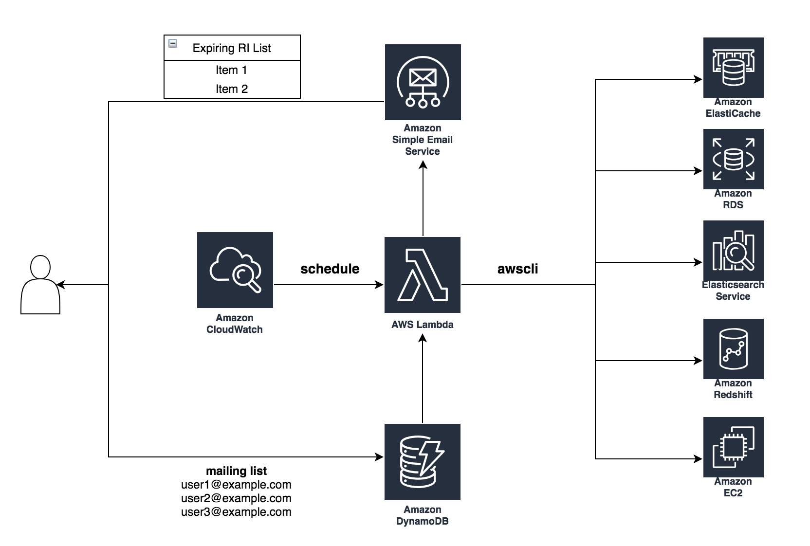

# aws-reserved-instance-expiration-notification

 Python SAM Lambda module for sending email about AWS Reserved Instance whose contract is expiring in 30 days.

 This is a sample template for aws-reserved-instance-expiration-notification. Below is a brief explanation of what we have generated for you:

```bash
.
├── README.md                   <-- This instructions file
├── event.json                  <-- API Gateway Proxy Integration event payload
├── src                         <-- Source code for a lambda function
│   ├── ri_expiration.py        <-- Lambda function code
│   ├── requirements.txt        <-- python library
├── template.yaml               <-- SAM Template
└── tests                       <-- Unit tests
    └── unit
        ├── __init__.py
        └── test_handler.py
```

## Requirements

* AWS CLI already configured with Administrator permission
* [AWS Serverless Application Model installed](https://docs.aws.amazon.com/serverless-application-model/latest/developerguide/serverless-sam-cli-install.html)
* [Docker installed](https://www.docker.com/community-edition)
* [Python 3 installed](https://www.python.org/downloads/)


## How to build

 Python SAM Lambda module for sending email about AWS Reserved Instance whose contract is expiring in 30 days.
 The monitored services are Amazon EC2, Amazon ElastiCache, Amazon RDS, and Elasticsearch Service.



Download the source code by using git.

```bash
git clone https://github.com/awslabs/aws-reserved-instance-expiration-notification.git
cd aws-reserved-instance-expiration-notification
```

In this instruction, we are going to build reserved instance notification system in Seoul region (ap-northeast-2).

```bash
aws configure set default.region ap-northeast-2
``` 

Replace the sender's email address. You will need to verify this email address via SES later. 

```python
SENDER = "USER_NAME <user@example.com>"
```

Use this command to build the Lambda source code, DynamoDB and generate deployment artifacts that target Lambda's execution environment.

```bash
sam build
```

Create an S3 bucket in the location where you want to save the packaged code. If you want to use an existing S3 bucket, skip this step.

```bash
Date=$(date +'%d%m%Y-%H%M%S')
aws s3 mb s3://aws-reserved-instance-expiration-notification-$Date
```

Create the Lambda function deployment package by running the following package AWS SAM CLI command at the command prompt.

```bash
sam package \
    --template-file .aws-sam/build/template.yaml \
    --output-template-file packaged.yaml \
    --s3-bucket aws-reserved-instance-expiration-notification-$Date
```

In the AWS SAM CLI, use the deploy command to deploy all of the resources that you defined in the template.

```bash 
sam deploy \
    --template-file packaged.yaml \
    --stack-name ri-exp-app \
    --capabilities CAPABILITY_IAM \
    --region ap-northeast-2
```

Go to [AWS Lambda Console](https://ap-northeast-2.console.aws.amazon.com/lambda), you can see a Lambda Function like "%RIExpNotificationLambdaFunction%" 

## How to Use

You can put email addresses into DynamoDB table.

```bash
aws dynamodb put-item \
    --table-name ri_exp_mailing \
    --item '{"email":{"S":"user@example.com"}}'
```

Before you can send an email using Amazon SES, you must verify the address or domain that you are sending the email from to prove that you own it. If you do not have production access yet, you also need to verify any email addresses that you send emails to except for email addresses provided by the Amazon SES mailbox simulator.

```bash
# we are going to use Amazon SES in N. Virginia.
aws configure set default.region us-east-1
aws ses verify-email-identity --email-address "user@example.com"
```

## Configuration

If you want to customize configurations, you can change the values in template.yaml.

For example, you can change the schedule invoking the Lambda function in **Events** phrase of template.yaml.

```yaml
      Events:
        Schedule1:
          Type: Schedule
          Properties:
            Schedule: cron(0 8 1 * ? *)
```

## License 

This library is licensed under the Apache 2.0 License.
